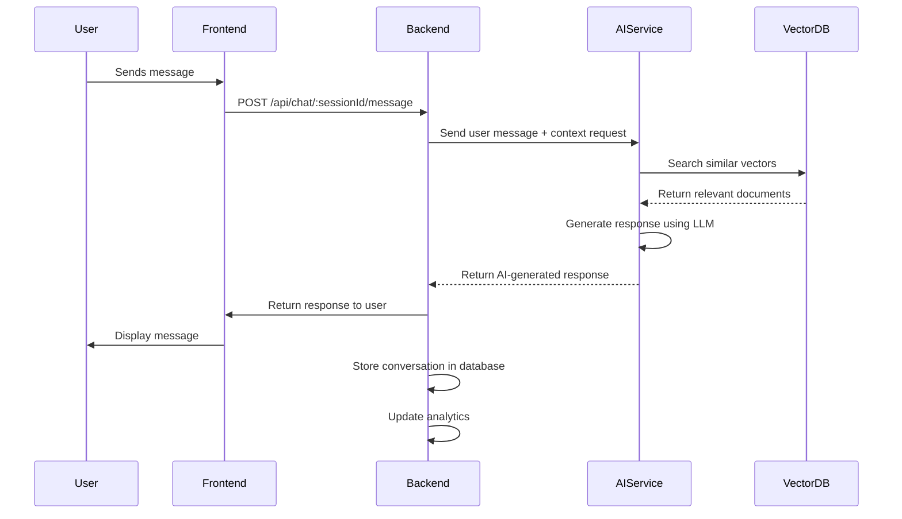

# AI Service Integration Guide

## Overview
This document explains how the AIBridge backend integrates with external AI services. As specified in the requirements, the backend does not implement AI models, embeddings, vector databases, prompt engineering, chatbot logic, or RAG pipelines. These are handled by external services.

## Architecture Overview
The AIBridge backend serves as an orchestration layer that:
1. Manages user data, business information, and workflow
2. Coordinates with external AI services for specific tasks
3. Stores metadata and results from AI service interactions
4. Provides a clean API for frontend applications

## External AI Service Responsibilities
External AI services are responsible for:
- Language Model (LLM) inference for chatbot responses
- Text embedding generation
- Vector storage and similarity search
- Document processing and text extraction
- Prompt engineering and optimization
- Chatbot conversation logic
- AI readiness assessment algorithms

## Integration Points

### 1. Document Processing
When a document is uploaded:
1. Backend stores document metadata and file
2. Backend triggers document processing workflow
3. External service extracts text from PDF/DOCX/TXT files
4. External service generates text embeddings
5. External service stores embeddings in vector database
6. Backend updates document status and knowledge base metadata

### 2. Website Content Processing
When a website is crawled:
1. Backend fetches website content (HTML)
2. External service extracts relevant text content
3. External service generates embeddings for content
4. External service stores embeddings in vector database
5. Backend updates website metadata and knowledge base

### 3. Knowledge Base Queries
When a chatbot needs to respond:
1. Backend receives user message via chat endpoint
2. Backend sends message to external AI service for processing
3. External service performs vector search in knowledge base
4. External service generates contextual response using LLM
5. Backend stores conversation and returns response to user

### 4. AI Readiness Assessment
When generating an audit:
1. Backend collects business data (website, documents, profile)
2. Backend sends data to external AI service for analysis
3. External service evaluates AI readiness using proprietary algorithms
4. External service returns readiness score, opportunities, recommendations
5. Backend stores audit results and notifies user

## Service Interface Contracts

### Document Processing Service
**Input**: Document file (PDF, DOCX, TXT)
**Output**: 
- Extracted text
- Embeddings (vector representation)
- Metadata (page count, language, etc.)

### Vector Storage Service
**Input**: 
- Text chunks with embeddings
- Associated metadata (document ID, business ID, etc.)
**Operations**:
- Store vectors with metadata
- Similarity search (find most similar vectors)
- Delete vectors by ID or metadata
- Update vectors

### Language Model Service
**Input**: 
- Prompt (user message + context from knowledge base)
- Model parameters (temperature, max tokens, etc.)
**Output**: Generated text response

### AI Readiness Assessment Service
**Input**: 
- Business profile data
- Website content summary
- Document metadata and samples
- Industry information
**Output**: 
- Readiness score (0-100)
- Business summary
- AI opportunities
- Automation suggestions
- Estimated benefits
- Strengths and weaknesses
- Suggested solutions
- Expected ROI

## Error Handling and Resilience
1. **Timeouts**: External service calls have configurable timeouts
2. **Retry Logic**: Failed requests are retried with exponential backoff
3. **Circuit Breaker**: Prevents cascading failures when service is down
4. **Fallback Responses**: Provide minimal functionality when AI services unavailable
5. **Logging**: All interactions with external services are logged for debugging

## Security Considerations
1. **Data Privacy**: No PII is sent to external services unless necessary
2. **Data Encryption**: Data in transit to external services uses TLS
3. **API Keys**: External service credentials stored securely in environment variables
4. **Rate Limiting**: Backend implements rate limiting to protect external services
5. **Input Validation**: All data sent to external services is validated

## Implementation Approach
The backend uses adapter patterns to integrate with external services:

```javascript
// Example adapter pattern
class DocumentProcessingAdapter {
  async extractText(fileBuffer, fileType) {
    // Call external service API
    const response = await axios.post(
      `${EXTERNAL_SERVICE_URL}/extract-text`,
      { file: fileBuffer.toString('base64'), type: fileType },
      { headers: { 'Authorization': `Bearer ${API_KEY}` } }
    );
    return response.data.text;
  }
  
  async generateEmbeddings(text) {
    // Call external service API
    const response = await axios.post(
      `${EXTERNAL_SERVICE_URL}/generate-embeddings`,
      { text: text },
      { headers: { 'Authorization': `Bearer ${API_KEY}` } }
    );
    return response.data.embeddings;
  }
}

// Usage in service layer
const documentAdapter = new DocumentProcessingAdapter();
const text = await documentAdapter.extractText(fileBuffer, fileType);
const embeddings = await documentAdapter.generateEmbeddings(text);
```

## Configuration
External service configuration is managed through environment variables:
- `EXTERNAL_DOCUMENT_SERVICE_URL`: Document processing service endpoint
- `EXTERNAL_EMBEDDING_SERVICE_URL`: Embedding generation service endpoint
- `EXTERNAL_LLM_SERVICE_URL`: Language model service endpoint
- `EXTERNAL_AUDIT_SERVICE_URL`: AI readiness assessment service endpoint
- `EXTERNAL_API_KEY`: Authentication key for external services
- `EXTERNAL_SERVICE_TIMEOUT`: Request timeout in milliseconds

## Development and Testing
1. **Mock Services**: During development, use mock implementations of external services
2. **Contract Testing**: Verify that requests/responses match expected schemas
3. **Integration Testing**: Test against staging versions of external services
4. **Monitoring**: Track latency, error rates, and usage of external services

## Future Extensibility
The adapter pattern allows for:
1. Switching between different external service providers
2. Using multiple services for different capabilities (best-of-breed approach)
3. Adding new AI capabilities without changing core backend logic
4. Implementing fallback mechanisms when primary services fail

## Example Integration Flow: Chatbot Response


This design ensures that the AIBridge backend remains focused on its core responsibilities while leveraging specialized external services for AI capabilities.